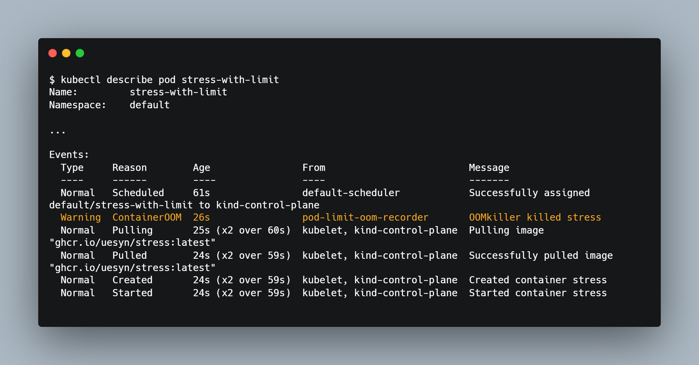

# pod-limit-oom-recorder

Kubernetes kubelet watches Out-of-Memory, and record them as kubernetes events resource.
However, kubelet doesn't catch OOM events which Pod consumes over '.spec.containers.resources.limits'.
pod-limit-oom-recorder records these events as kubernetes events resource.



# Installation

```bash
kubectl apply -f https://raw.githubusercontent.com/uesyn/pod-limit-oom-recorder/master/manifests/deploy.yaml
```

# Usage

```
pod-limit-oom-recorder watchs the Pod oom and record it as Kubernetes Event.
Usage:
  pod-limit-oom-recorder [options]
Options:
      --add_dir_header                   If true, adds the file directory to the header of the log messages
      --address string                   Address and port to listen for health check. (default "0.0.0.0:8080")
      --alsologtostderr                  log to standard error as well as files
  -h, --help                             Show help message.
      --kubeconfig string                Path to kubeconfig file to override in-cluster configuration.
      --log_backtrace_at traceLocation   when logging hits line file:N, emit a stack trace (default :0)
      --log_dir string                   If non-empty, write log files in this directory
      --log_file string                  If non-empty, use this log file
      --log_file_max_size uint           Defines the maximum size a log file can grow to. Unit is megabytes. If the value is 0, the maximum file size is unlimited. (default 1800)
      --logtostderr                      log to standard error instead of files (default true)
      --node string                      Cache only the Pods on this node.
      --skip_headers                     If true, avoid header prefixes in the log messages
      --skip_log_headers                 If true, avoid headers when opening log files
      --stderrthreshold severity         logs at or above this threshold go to stderr (default 2)
  -v, --v Level                          number for the log level verbosity
      --vmodule moduleSpec               comma-separated list of pattern=N settings for file-filtered logging
```

You can watch the container oom events which consumes over '.spec.resources.limits.memory' with `kubectl describe` or `kubectl get events`. 

# License

This software is released under the [MIT license](https://en.wikipedia.org/wiki/MIT_License).
